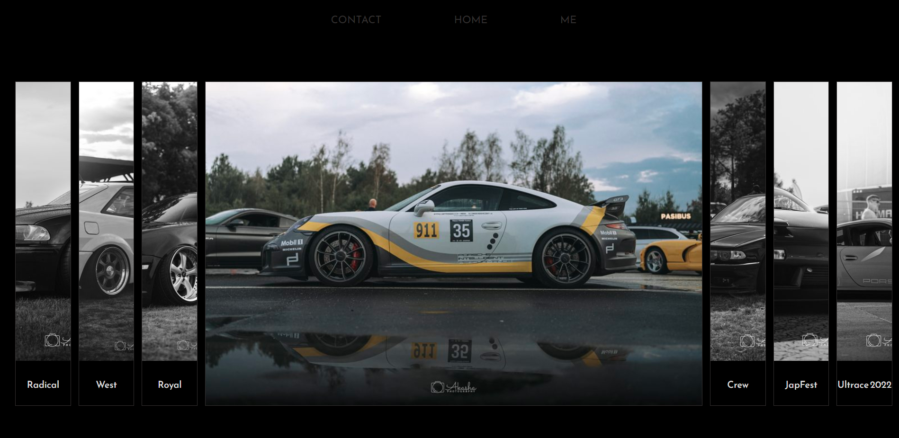
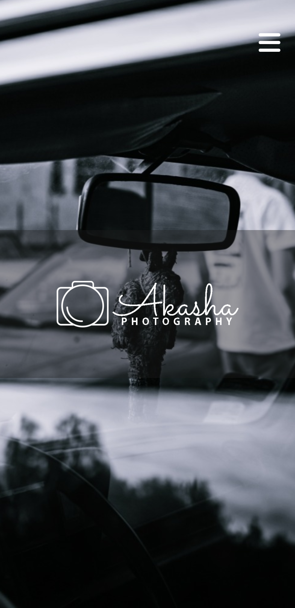

# Akasha Photography - Car photography portfolio

Because automotive photography is one of my hobbies, I made this small website with my photo portfolio 📸.
Mainly for displaying images downloaded from the folder on imgur

## Screenshot

 

## Demo

- A live demo can be found [here](https://xakashax.github.io/photo_website/)

## Built with

- HTML5
- CSS3/Flexbox/CSS grid/pseudo-elements
- Mobile First
- JS
- Imgur API

Thanks a lot for [skundlony](https://github.com/skundlony) 🙏 help with linking the project with imgur API. Without his help, I wouldn't be able to do it.

## Figma projects

## Useful resources

- [Gallery with hover effect by Author Mert Cukuren](https://codepen.io/knyttneve/pen/YgZbLO) - Create a image gallery with HTML and CSS.

## Photos

All car photos are taken by me.
